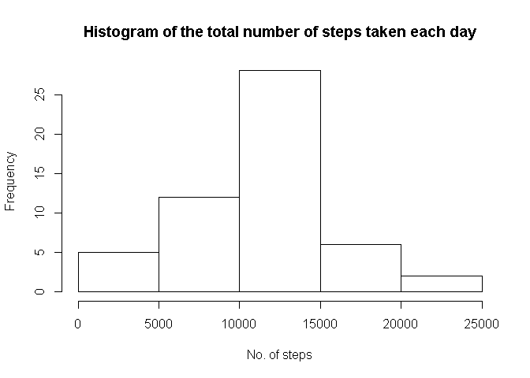
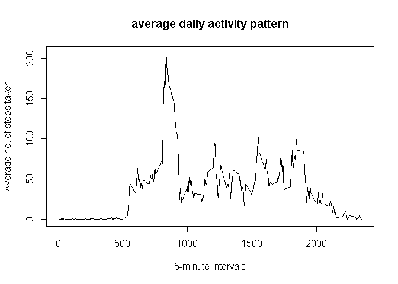

# Reproducible Research: Peer Assessment 1


## Loading and preprocessing the data
  

```r
unzip("activity.zip")
activity_data <- read.csv("activity.csv", header=TRUE)
activity_data$date <- as.POSIXct(activity_data$date, format="%Y-%m-%d")
```


## What is mean total number of steps taken per day?
Histogram of the total number of steps taken each day  


```r
histo_data <- aggregate(steps ~ date, data = activity_data, sum, 
                      na.action = na.omit)

hist(histo_data$steps, 
     main = "Histogram of the total number of steps taken each day",
     xlab = "No. of steps")
```

 

```r
mean(histo_data$steps)
```

```
## [1] 10766.19
```


```r
median(histo_data$steps)
```

```
## [1] 10765
```
## What is the average daily activity pattern?

```r
interval_data <- aggregate(steps ~ interval, data = activity_data, mean, 
                      na.action = na.omit)

plot(interval_data$interval, 
     interval_data$steps, 
     type="l",
     main="average daily activity pattern",
     xlab="5-minute intervals",
     ylab="Average no. of steps taken")
```

 

```r
interval_data[which.max(interval_data$steps),1]
```

```
## [1] 835
```

```r
## Imputing missing values


## Are there differences in activity patterns between weekdays and weekends?
```
