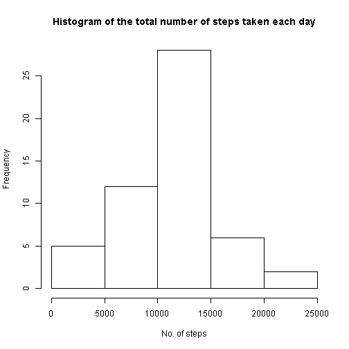
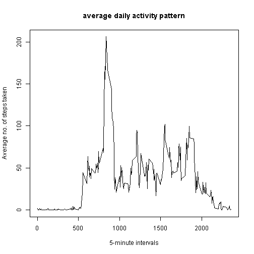
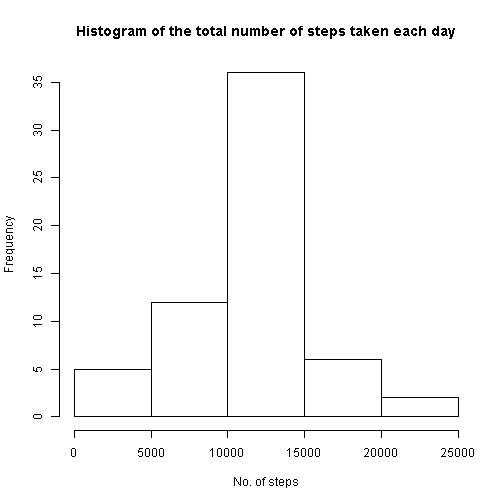
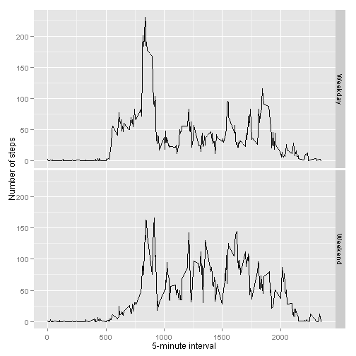

  
==========================================================================================  


## Loading and preprocessing the data

```r
unzip("activity.zip")
activity_data <- read.csv("activity.csv", header=TRUE)
activity_data$date <- as.POSIXct(activity_data$date, format="%Y-%m-%d")
```

#### Histogram of the total number of steps taken each day  


```r
histo_data <- aggregate(steps ~ date, data = activity_data, sum, 
                        na.action = na.omit)

hist(histo_data$steps, 
     main = "Histogram of the total number of steps taken each day",
     xlab = "No. of steps")
```

 

#### The mean and median total number of steps taken per day

```r
mean(histo_data$steps)
```

```
## [1] 10766.19
```


```r
median(histo_data$steps)
```

```
## [1] 10765
```
===========================================================================================  

## What is the average daily activity pattern?
#### Time series plot of the 5-minute interval and the average number of steps taken, averaged across all days

```r
interval_data <- aggregate(steps ~ interval, data = activity_data, mean, 
                           na.action = na.omit)

plot(interval_data$interval, 
     interval_data$steps, 
     type="l",
     main="average daily activity pattern",
     xlab="5-minute intervals",
     ylab="Average no. of steps taken")
```

 

#### Which 5-minute interval, on average across all the days in the dataset, contains the maximum number of steps?

```r
interval_data[which.max(interval_data$steps),1]
```

```
## [1] 835
```
===========================================================================================  

## Inputing missing values
#### The total number of missing values in the dataset 

```r
sum(is.na(activity_data$steps))
```

```
## [1] 2304
```
#### Replacing the missing values(NAs) with the mean for that interval


```r
naFilledUp_data <- activity_data

fillData <- function(steps, interval) {
    value <- NA
    if(is.na(steps))
        value <- interval_data[interval_data$interval==interval, 2]
    else
        value <- steps
    return(value)
}

naFilledUp_data$steps <- mapply(fillData, naFilledUp_data$steps, naFilledUp_data$interval)
```

#### Histogram of the total number of steps taken each day with missing data filled up

```r
histo_data <- aggregate(steps ~ date, data = naFilledUp_data, sum, na.action = na.omit)

hist(histo_data$steps, 
     main = "Histogram of the total number of steps taken each day",
     xlab = "No. of steps")
```

 

#### Mean and Median of the total number of steps taken each day with missing data filled up

```r
mean(histo_data$steps)
```

```
## [1] 10766.19
```

```r
median(histo_data$steps)
```

```
## [1] 10766.19
```
#### There are no significant change in mean and median!  

=========================================================================================  


## Are there differences in activity patterns between weekdays and weekends?  
#### Create a new factor variable in the dataset with two levels - "weekday" and "weekend"

```r
naFilledUp_data$day <- "Weekday"
naFilledUp_data[weekdays(naFilledUp_data$date) 
                    %in% c("Saturday", "Sunday"),]$day <-"Weekend"
naFilledUp_data$day <- as.factor(naFilledUp_data$day)
```

#### Panel plot containing a time series plot of the 5-minute interval (x-axis) and the average number of steps taken, averaged across all weekday days or weekend days


```r
interval_data <- aggregate(steps ~ interval + day, data = naFilledUp_data, mean, 
                            na.action = na.omit)
library(ggplot2)
ggplot(interval_data, aes(interval, steps)) + geom_line() + facet_grid(day ~ .) +
     xlab("5-minute interval") + ylab("Number of steps")
```

 
